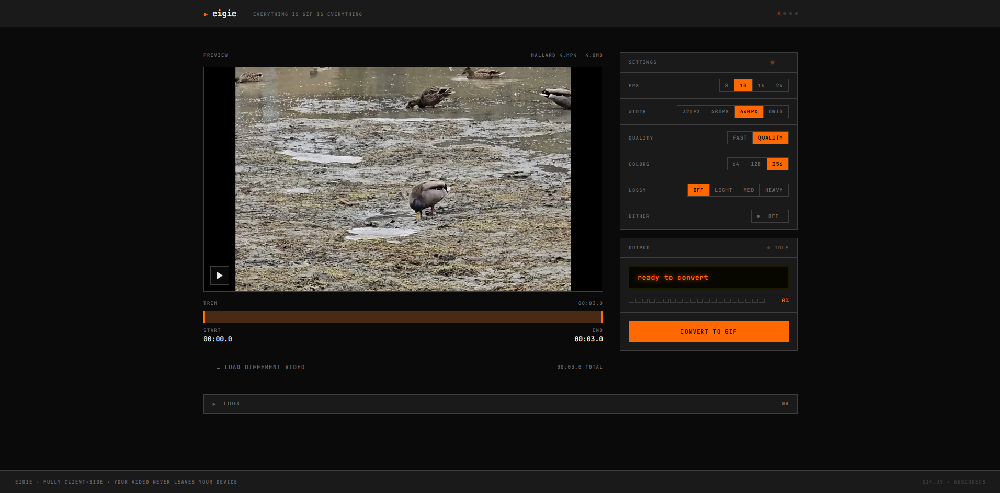

# eigie

**everything is gif is everything**



[](https://ko-fi.com/E1E11RQ6PT)

A fully client-side video-to-GIF converter. Your video never leaves your device.

Built with React + Vite and [gif.js](https://github.com/jnordberg/gif.js) for browser-based GIF encoding via Web Workers.

Design inspired by [Teenage Engineering](https://teenage.engineering) — industrial aesthetic, monospace type, orange-on-black, LED readouts, segmented controls.

## Features

- **Drag-and-drop upload** — MP4, WebM, MOV, AVI, MKV (up to 2 GB)
- **Trim timeline** — Dual-handle scrubber to select a clip region before converting
- **Configurable output** — FPS (8/10/15/24), width (320/480/640/original), quality, dithering, color count, lossy compression
- **Live conversion logs** — Timestamped log panel with auto-scroll, copy-all, and error badge
- **GIF download** — One-click download with file size readout
- **WhatsApp share** — Native share on mobile, WhatsApp Web fallback on desktop
- **Fully offline** — No server, no API calls, no uploads. Everything runs in the browser

## How It Works

1. Video frames are extracted via `<video>` + `<canvas>` drawImage using `requestVideoFrameCallback` (falls back to seek-based on unsupported browsers)
2. Frames are processed client-side: lossy color snapping, frame delta with transparency, duplicate frame detection
3. Processed frames are fed progressively to gif.js, which encodes them in parallel across multiple Web Workers using NeuQuant color quantization
4. The encoded GIF is available for download or sharing — nothing is uploaded

## Getting Started

```bash
# Install dependencies
npm install

# Start dev server
npm run dev

# Production build
npm run build

# Preview production build
npm run preview
```

## Project Structure

```
src/
  App.jsx                 — Main component, state machine (idle/previewing/converting/done/error)
  hooks/
    useGifEncoder.js      — Core conversion: frame extraction, delta encoding, gif.js orchestration
  components/
    UploadZone.jsx        — Drag-and-drop + file picker with validation
    VideoPreview.jsx      — Video player with dual-handle trim timeline
    ControlPanel.jsx      — Settings panel (FPS, width, quality, dither, colors, lossy)
    ConversionDisplay.jsx — LED status display, segmented progress bar, convert button
    OutputPanel.jsx       — GIF preview, download, WhatsApp share
    LogsPanel.jsx         — Collapsible live log viewer
  styles/
    tokens.css            — Design tokens (colors, spacing, typography)
    global.css            — Global styles, button variants, scrollbars
public/
  gif.worker.js           — gif.js Web Worker (patched for disposal + transparency)
  favicon.svg             — Orange play triangle favicon
```

## Settings Guide

| Setting | Options | Effect |
|---------|---------|--------|
| **FPS** | 8, 10, 15, 24 | Frames per second. Lower = smaller file, choppier motion |
| **Width** | 320px, 480px, 640px, orig | Output width (height scales proportionally). Lower = smaller file |
| **Quality** | fast, quality | NeuQuant sampling. Quality produces better colors but encodes slower |
| **Dither** | off, floyd | Floyd-Steinberg dithering. Improves gradients but increases file size |
| **Colors** | 64, 128, 256 | Pre-quantization color reduction. Fewer colors = smaller file |
| **Lossy** | off, light, med, heavy | RGB channel rounding. Higher = smaller file, more color banding |

For the smallest file: 320px width, 8 fps, fast quality, dither off, 64 colors, heavy lossy.

For the best quality: original width, 24 fps, quality, dither floyd, 256 colors, lossy off.

## Size Optimization Pipeline

The encoder applies three optimizations before gif.js encodes each frame:

1. **Lossy color snap** — RGB values rounded to nearest step, reducing unique colors for better LZW compression
2. **Frame delta** — Unchanged pixels between frames are marked transparent, so only changed regions are encoded
3. **Duplicate skip** — Frames with <2% pixel change are dropped entirely; the previous frame's duration is extended

These optimizations combined typically reduce output size by 4-7x compared to naive frame-by-frame encoding.

## Tech Stack

- [React 19](https://react.dev) — UI
- [Vite 8](https://vite.dev) — Build tooling
- [gif.js](https://github.com/jnordberg/gif.js) — GIF encoding with Web Workers
- [JetBrains Mono](https://www.jetbrains.com/lp/mono/) — Monospace typeface

## Deployment

The app is static and can be deployed anywhere. A `vercel.json` is included with COOP/COEP headers.

```bash
npm run build
# Deploy the dist/ directory
```

## Changelog

See [CHANGELOG.md](CHANGELOG.md) for detailed release notes.

## License

Private project. [gif.js](https://github.com/jnordberg/gif.js) is MIT licensed.
